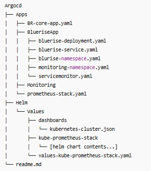
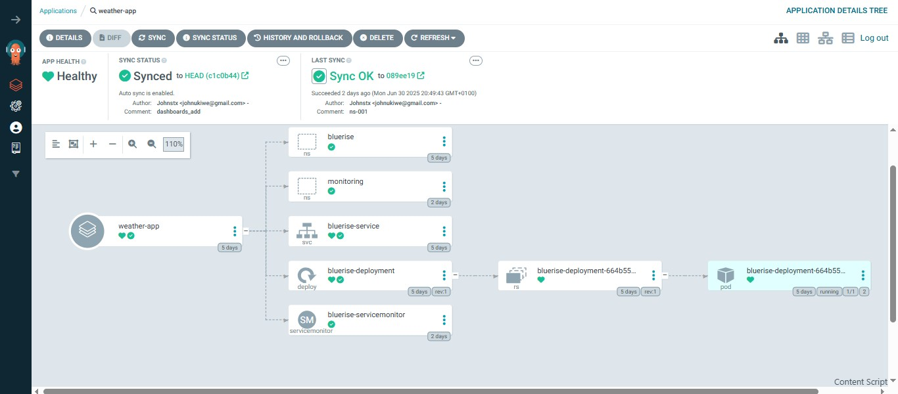

## A monitoring stack for a NodeJs Microservice using GitOps. 

In this lab -
 A  Weather checker app built on NodeJs and containerized as a microservice, is deployed using the GitOps process
 A monitoring stack of Prometheus-stack was employed to monitor the architecture.
 The operation will be executed adaopting the GitOps principle, using git as the source of truth. ArgoCD is used as the GitOps tool.

 ### Requirements

 1. **An accessible Github repo**. Generate an SSH on your terminal, then create ```new ssh key``` in github repo and add paste the **public key** in it
 2. **A Running kubernetes Cluster** I use KIND
 3. **ArgoCd**
--


### THE GITOPS SETUP

1. Clone github repo into your workspace

```bash
git clone git@github.com:Johnstx/gitops-with-argocd.git
```
Confirm its connected
```
ssh -T git@github.com
``` 
2.
-- kubectl create namespace argocd
-- kubectl apply -n argocd -f <https://raw.githubusercontent.com/argoproj/argo-cd/stable/manifests/install.yaml>

**Access ArgoCd on the browser**
-- kubectl port-forward svc/argocd-server 8080:80 -n argocd


-- kubectl get secret argocd-secret -n argocd -o yaml

-- kubectl get secret argocd-secret -n argocd -o jsonpath="{.data.admin.password}" | base64 -d; echo

**Replace the  login password with custom password**
-- kubectl patch secret argocd-secret -n argocd -p '{"stringData": {"admin.password": "'$(htpasswd -bnBC 10 "" passW0Rd | tr -d ':\n')'", "admin.passwordMtime": "'$(date +%FT%T%Z)'"}}'


**Install the argocd CLI**
-- brew install argocd

-- export ARGOCD_SERVER=localhost:8080

-- argocd login $ARGOCD_SERVER

**Add a Repo to argocd server**
-- argocd repo add  <git@github.com>:Johnstx/GitOps-with-ArgoCD.git --ssh-private-key-path /home/stax/.ssh/id_rsa

**Create ArgoCd Applications**
This manifest files should be in your folders. File structure might be similar to - 



-- argocd app create -f /mnt/c/Users/USER/Documents/staxxwrkspace/APPS/testApp/kind-bluerise-app/Monitoring-Stack-for-a-NodeJs-application/GitOps-with-ArgoCD/Argocd/Apps/BR-core-app.yaml


-- argocd app create -f /mnt/c/Users/USER/Documents/staxxwrkspace/APPS/testApp/kind-bluerise-app/Monitoring-Stack-for-a-NodeJs-application/GitOps-with-ArgoCD/Argocd/Apps/prometheus-stack.yaml

**NB**
- Port-forward Grafana
-- kubectl port-forward svc/kube-prometheus-stack-grafana 3000:80 -n monitoring
username: admin

password: -
Run below for password
```kubectl get secret --namespace monitoring kube-prometheus-stack-grafana -o jsonpath="{.data.admin-password}" | base64 --decode ; echo```

-- Ensure the servicemonitor is deployed and in same namespace as the prometheus-stack




After login to Grafana, you can configure dashboard or impoirt from grafana.com

--